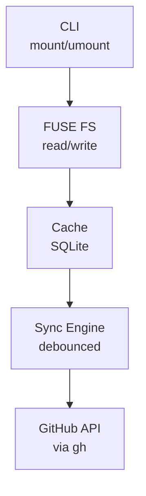

# Story Map: ghissues

## User Journey (Backbone)

```
Setup → Mount → Browse → Read → Edit → Sync → Unmount
```

## Activity Breakdown

### Setup
| Task | Description |
|------|-------------|
| Install binary | Single `go install` or download |
| Auth with GitHub | Use `gh` CLI auth token |

### Mount
| Task | Description |
|------|-------------|
| Specify repo | `ghissues mount owner/repo ./path` |
| Choose mountpoint | Any empty directory |
| Create cache | Initialize SQLite database |
| Initial sync | Fetch all issues, populate cache |

### Browse
| Task | Description |
|------|-------------|
| `ls` directory | List all issues as `.md` files |
| See filenames | Format: `title[id].md` |
| Filter/grep | Standard unix tools work |

### Read
| Task | Description |
|------|-------------|
| `cat` file | Output full markdown content |
| View frontmatter | See metadata (state, labels, author, etc.) |
| See comments | Rendered in markdown format |
| Trigger refresh | Background fetch on read, use etag/304 |

### Edit
| Task | Description |
|------|-------------|
| Open in editor | Any editor works (vim, vscode, etc.) |
| Modify body | Edit issue description |
| Add comment | Append new comment section |
| Edit title | Change the `# Title` heading |

### Sync
| Task | Description |
|------|-------------|
| Detect changes | Track dirty files in cache |
| Debounce writes | Wait X ms after last flush |
| Push to API | Update issue via GitHub API |
| Handle conflicts | Local wins unless remote is newer |

### Unmount
| Task | Description |
|------|-------------|
| Run unmount | `ghissues unmount ./path` |
| Flush pending | Force sync any dirty files |
| Cleanup | Unmount FUSE, close DB |

---

## Release Slices

### Slice 1: Walking Skeleton
Thinnest end-to-end proof of concept.

- Mount a repo with `gh` auth
- List issues as files
- Read one issue as markdown
- Edit body, syncs to GitHub
- Unmount cleanly

### Slice 2: Full Read Experience
- Frontmatter with all metadata
- Comments rendered properly
- Background refresh with etag/304
- Proper filename sanitization

### Slice 3: Full Edit Experience
- Edit title
- Add new comments
- Edit existing comments
- Create new issues

### Slice 4: Robustness
- Offline mode (serve from cache)
- Conflict resolution
- Rate limit handling
- Error recovery

### Slice 5: Polish
- Pagination for large repos
- Filtering (open/closed/labels)
- Watch for real-time updates
- Performance optimization

---

## Walking Skeleton: Implementation Tasks

### 1. Project Setup
- [ ] Initialize Go module
- [ ] Set up directory structure
- [ ] Add dependencies (FUSE library, SQLite driver)

### 2. CLI Foundation
- [ ] `mount` command with args: `owner/repo`, `mountpoint`
- [ ] `unmount` command with arg: `mountpoint`
- [ ] Basic argument validation

### 3. GitHub Client
- [ ] Read auth token from `gh` CLI config
- [ ] Fetch list of issues for a repo
- [ ] Fetch single issue by number
- [ ] Update issue body

### 4. SQLite Cache
- [ ] Schema: issues table (id, number, title, body, state, etag, updated_at, dirty)
- [ ] Insert/update issues
- [ ] Mark issue as dirty
- [ ] Get dirty issues for sync

### 5. Markdown Formatter
- [ ] Issue → Markdown (minimal: frontmatter + title + body)
- [ ] Markdown → Issue (parse body changes)

### 6. FUSE Filesystem
- [ ] Mount/unmount lifecycle
- [ ] `readdir`: list issues as `title[number].md`
- [ ] `read`: serve markdown from cache
- [ ] `write`: parse markdown, update cache, mark dirty

### 7. Sync Engine
- [ ] Debounce timer on flush
- [ ] Push dirty issues to GitHub API
- [ ] Clear dirty flag on success

### 8. Integration
- [ ] Wire all components together
- [ ] End-to-end test: mount → read → edit → verify on GitHub

---

## Architecture



## Design Decisions

| Decision | Choice | Rationale |
|----------|--------|-----------|
| Language | Go | Single binary, good FUSE support |
| Auth | `gh` CLI token | Already configured, no extra setup |
| Cache | SQLite | Reliable, single file, SQL queries |
| Sync trigger | Debounced flush | Batch rapid edits, reduce API calls |
| Conflict resolution | Local wins (unless remote newer) | User's edits are intentional |
| Initial load | Sync all issues | Simple, predictable |
| Read behavior | Serve cache, background refresh | Fast reads, eventual consistency |
